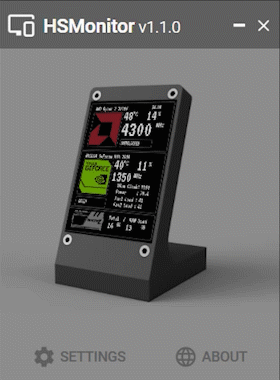

#  Hardware Sync Monitor

**HSMonitor** is an application that is a back-end application that reads PC status data and sends it to a special device based on Arduino. \
This device allows you to quickly monitor the temperature and degree of CPU and GPU utilization, power consumption, and so on, without being distracted from other things.

## Features

- Simple lightweight WPF application
- Easy to add to startup
- Advanced customization
- Quick setup

## Notes

> This application requires administrator rights to work correctly so that the libraries used can send data about the characteristics of the processor.

## Download & Usage

> ### **Warning!**
> Supported OS version: Windows 7 and higher. \
> The latest release is not yet fully tested and awaits your feedback!

- [**Latest release**](https://github.com/TTLC198/HSMonitor/releases)

## Preview

