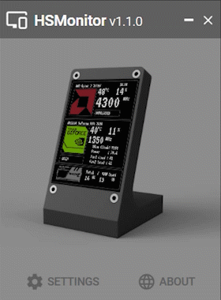

#  Hardware Sync Monitor

If you are from England, [here.](Readme.md)

**HSMonitor** это приложение для считывания показателей датчиков компьютера и отправки этих данных на специальное устройство, разработанное на базе Arduino. \
Этот девайс позволит вам быстро проверить температуру и степень загрузки процессора и видеокарты, их энергопотребление, и все это не отвлекаясь от других вещей.

## Плюсы

- Простое и легковесное приложение на базе WPF
- Легко добавить в автозагрузку
- Автоматические обновления
- Продвинутая кастомизация
- Быстрая настройка

## Особенности

> Этому приложение необходимо получить права администратора при запуске для того, чтобы программа смогла считать данные по процессору.

## Установка и использование

> ### **Внимание!**
> Поддерживаемые версии OS начинаются с Windows 7 и выше. \
> Последний релиз, как правило не полностью протестирован, поэтому ждет твоего фидбека!

- [**Скачать**](https://github.com/TTLC198/HSMonitor/releases)

## Предпросмотр

